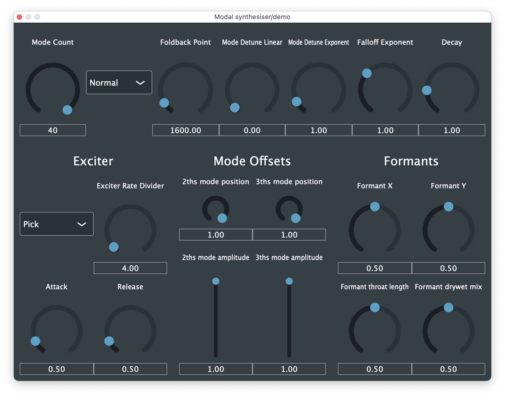

# Modal Synth

[code](https://github.com/crispinha/modal-synth) | [download](https://github.com/crispinha/modal-synth/releases/) | presentation [pptx](https://github.com/crispinha/modal-synth/releases/download/canz-conf-release/CANZ.presentation.pptx) [pdf](https://github.com/crispinha/modal-synth/releases/download/canz-conf-release/CANZ.presentation.pdf) | [discuss](https://github.com/crispinha/modal-synth/discussions)

This is a software synthesiser that uses modal synthesis, a
physical modelling technique using banks of resonators to filter an exciter signal, to create
sounds with a parametrically controlled frequency spectrum. This synthesiser is designed to
allow for the composition and performance of spectral music, and it produces sounds with timbres
similar to those of natural materials such as wood, metal, and glass.

The synthesiser is available as VST and AU plugins and as a standalone application. It is written in C++ using the JUCE audio framework.

